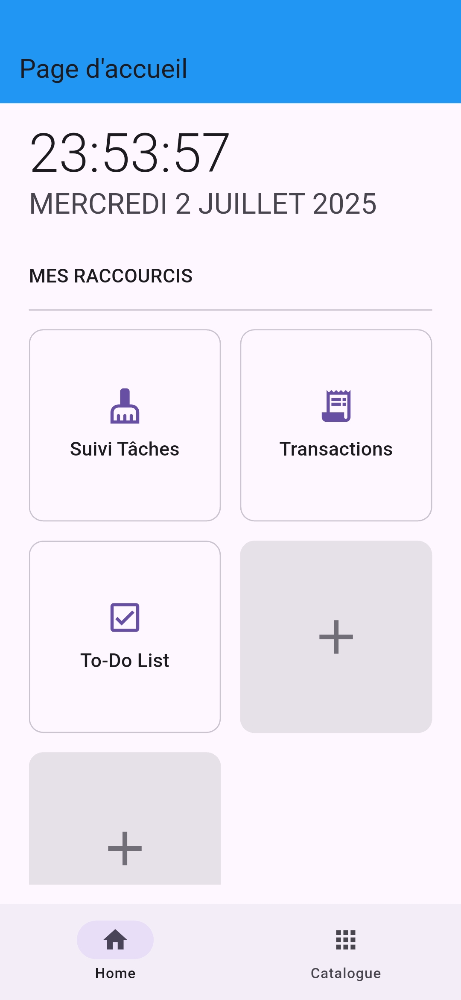
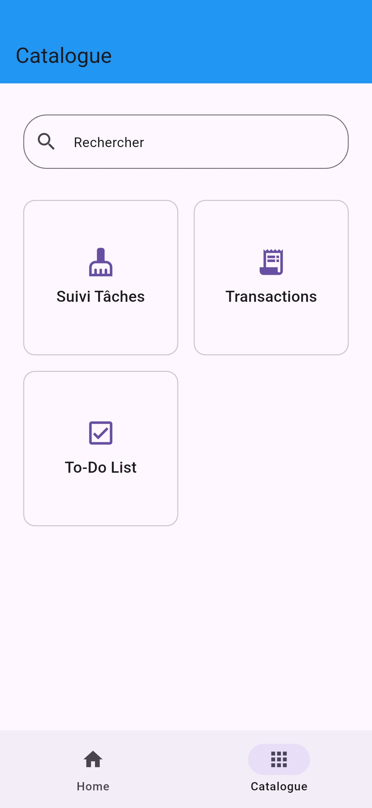

# MultiTools 🛠️

An all-in-one Flutter application built as a personal portfolio to master and demonstrate best practices in mobile development. This app consolidates a collection of useful daily tools.

## Overview 📸

- *Home page*



- *Catalogue*



## About the project 📝

This project was born from the desire to create a personal "super-app" that centralizes all the daily tools I need. Above all, it serves as an evolving portfolio to not only master robust software architectures with Flutter, but also to hone my skills in core programming logic, UI/UX design, and creating maintainable, cross-platform applications.

## ✨ Features

* **Home Page :** Displays current time & date, and allows users to manage their favorite app shortcuts for quick access.

* **Catalogue :**  A browsable and searchable list of all available mini-apps.

* **Track chores :** Calculates earnings from completed household chores.

* **Transaction :** Helps to keep an eye on the money we borrow and the money we lend 

* **To Do list :**  A simple yet effective task manager to track objectives.

## Getting Started 🏁

To get a local copy up and running, follow these simple steps.

1.  Clone the repo
    ```sh
    git clone https://github.com/dadacoc/multitools.git
    ```
2.  Install packages
    ```sh
    flutter pub get
    ```
    
3.  Check device
    ```sh
    flutter devices or flutter doctor -v
    ```

4.  Run the app
    ```sh
    flutter run -d <deviceID or name (prefixes allowed)>
    ```

## Build with 🚀

* [Flutter](https://flutter.dev/)
* [Dart](https://dart.dev/)
* [Provider](https://pub.dev/packages/provider)
* [GoRouter](https://pub.dev/packages/go_router)
* [sqflite](https://pub.dev/packages/sqflite)
